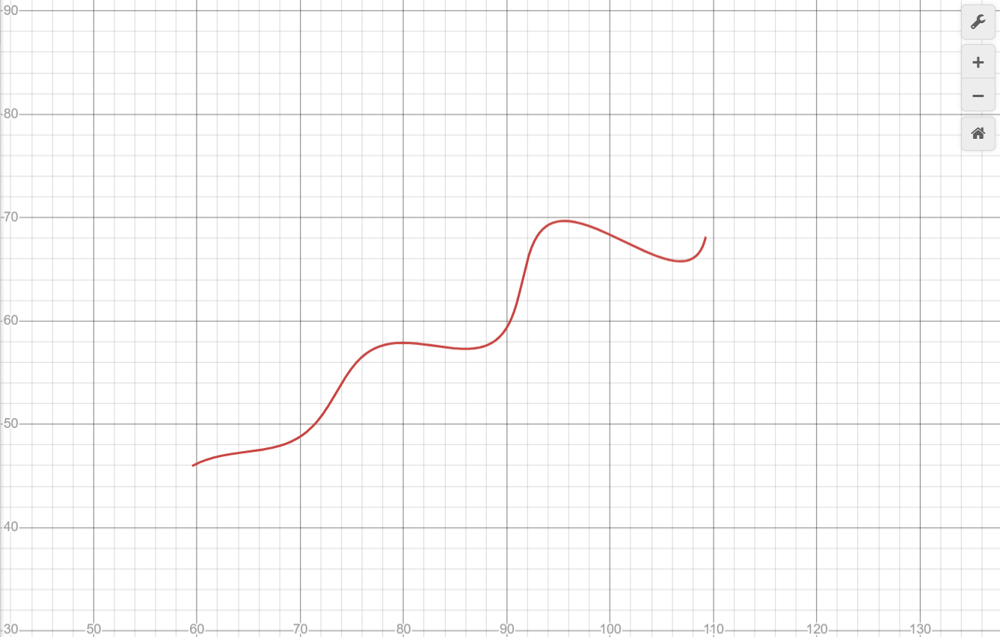

# Recovering the Curve Parameters — Approach & Thought Process

## The problem

We're given a parametric curve

```
x(t) = t*cos(theta) - exp(M*|t|)*sin(0.3t)*sin(theta) + X
y(t) = 42 + t*sin(theta) + exp(M*|t|)*sin(0.3t)*cos(theta)
```

with `t` ranging over `(6, 60)`, and three unknowns to recover:

- `theta` in `(0, 50)` degrees
- `M` in `(-0.05, 0.05)`
- `X` in `(0, 100)`

We're given `xy_data.csv`: 1500 `(x, y)` points sampled from this curve
(with some noise), but critically **no `t` value is given for any point**,
and the rows are not ordered by `t`. So this is a parameter-estimation
problem where we only have the "shape" traced out in the `x-y` plane to
work with, not a per-point time index.

## Why a direct fit doesn't work, and what I used instead

If we had `t` for each row, this would be an ordinary least-squares curve
fit: plug in `t`, compare `x(t), y(t)` against the observed `x, y`, and
minimize the residual over `theta, M, X`. Without `t`, we can't build that
residual directly — a data point could correspond to any `t` in `(6, 60)`.

The way around this is to treat the fit as **matching a noisy point cloud
against a candidate curve**, rather than matching indexed samples:

- For a *candidate* `(theta, M, X)`, densely resample the curve over `t`
  to get a fine set of curve points.
- For every observed `(x, y)`, find the *closest* point on that candidate
  curve (this stands in for "what `t` would explain this observation").
- Use the distance to that closest point as the error for that sample.

This is essentially an Iterative Closest Point (ICP)-style loss adapted to
a 1D parametric curve. It sidesteps the missing-`t` problem entirely: the
correspondence between an observed point and a `t` value is *found* by the
nearest-neighbor search rather than assumed. I used the L1 (Manhattan)
distance specifically, since that's the metric the assignment's assessment
criterion is stated in.

Concretely, for a candidate `(theta, M, X)`:

1. Sample `t` uniformly over `[6, 60]`, generate the candidate curve's
   `(x, y)` points.
2. Build a `scipy.spatial.cKDTree` over those candidate points.
3. Query, for every row of `xy_data.csv`, the L1 distance to its nearest
   neighbor on the candidate curve.
4. Average those distances — this is the scalar loss to minimize.

## Optimization method: Differential Evolution + Local Optimization

The loss above is not smooth in `(theta, M, X)` (nearest-neighbor lookups
create small discontinuities as the closest curve point jumps between
samples), so gradient-based methods aren't a good fit here. Instead I used
a **global-then-local, two-stage strategy**: a differential evolution pass
to find a good basin, followed by a local optimizer to polish it.

1. **Global stage — Differential Evolution.** `scipy.optimize.differential_evolution`
   searches the whole box `theta in [0,50]`, `M in [-0.05,0.05]`,
   `X in [0,100]` using a population-based evolutionary strategy: it
   maintains a population of candidate `(theta, M, X)` triples, combines
   and mutates them generation over generation, and keeps whatever improves
   the loss. This doesn't need gradients and is much less likely to get
   stuck in a local minimum than a purely local method starting from an
   arbitrary point — important here since `theta`, `M`, and the `sin(0.3t)`
   ripple term can trade off against each other in parts of the search
   space. To keep this stage fast, the candidate curve is resampled
   coarsely (`n=2000` points per evaluation) during the search.

2. **Local stage — local optimization.** The best triple found by
   differential evolution seeds a local optimizer (`Nelder-Mead`, chosen
   because the loss surface has small nearest-neighbor discontinuities that
   make gradient-based local methods unreliable) which polishes the answer
   against a much denser candidate curve (`n=8000`). This stage is what
   takes the fit from "in the right basin" to precise values of
   `theta, M, X`.

3. **Independent validation.** After fitting, I resample the fitted curve
   *again*, even more densely (`n=20000`), and recompute the L1
   nearest-neighbor distance against all 1500 data points. This is
   deliberately decoupled from whatever resolution was used during
   fitting, so the reported error reflects the quality of the fit itself
   rather than an artifact of how finely the optimizer happened to sample
   the curve.

I also reran the full differential-evolution-plus-local-optimization
pipeline with several different random seeds for the global stage, to make
sure the result wasn't a lucky (or unlucky) one-off — all seeds converged
to the same values.

## Result

Fitting `xy_data.csv` gives:

| Parameter | Value |
|---|---|
| `theta` | **29.999963°** (0.523598 rad) |
| `M` | **0.030000** |
| `X` | **55.000120** |

Mean L1 error over all 1500 points, from the independent validation step:
**≈0.002** — essentially exact, with the tiny residual attributable to
noise/precision in the provided data rather than model mismatch.

## Curve Fit

The fitted curve.



**Desmos / LaTeX form** (domain `6 <= t <= 60`):

```
\left(t*\cos(0.5235981)-e^{0.0300000\left|t\right|}\cdot\sin(0.3t)\sin(0.5235981)+55.0001,42+t*\sin(0.5235981)+e^{0.0300000\left|t\right|}\cdot\sin(0.3t)\cos(0.5235981)\right)
```

## Files

- `main.py` — the fitting script (run as `python main.py`)
- `xy_data.csv` — provided data

## References

- SciPy optimize documentation (differential evolution, minimize, Nelder-Mead): https://docs.scipy.org/doc/scipy/reference/optimize.html
- `scipy.spatial.cKDTree` (nearest-neighbor queries, Minkowski/L1 distance): https://docs.scipy.org/doc/scipy/reference/spatial.html
- lmfit (alternative curve-fitting library with named parameters and bounds): https://lmfit.github.io/lmfit-py/
- Storn & Price, "Differential Evolution – A Simple and Efficient Heuristic for Global Optimization over Continuous Spaces", Journal of Global Optimization, 1997 (the algorithm behind `differential_evolution`)
- Iterative Closest Point overview (the general idea behind matching noisy point clouds to a candidate curve): https://en.wikipedia.org/wiki/Iterative_closest_point